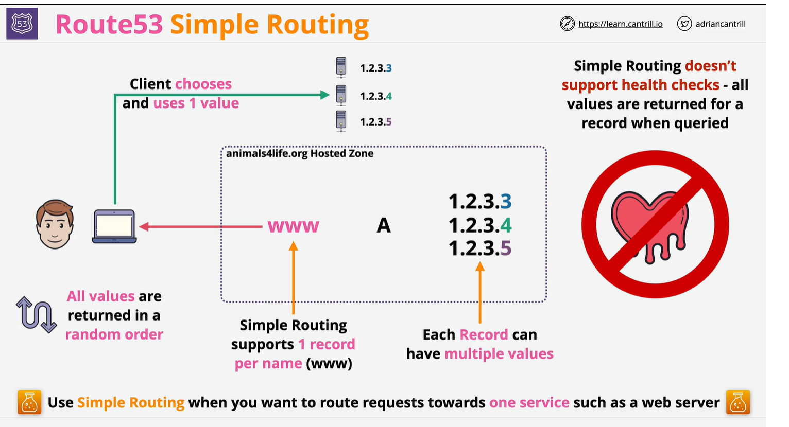

# Simple routing
    Simple routing lets you configure standard DNS records, with no special Route 53 routing such as weighted or latency. With simple routing, you typically route traffic to a single resource, for example, to a web server for your website.

    NOTE:
        Simple Routing does not support the health check.
        