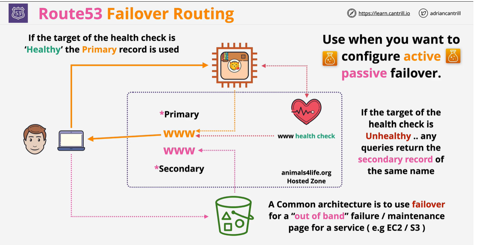

# Failover:
    Amazon Route 53 health checks monitor the health and performance of your web applications, web servers, and other resources. Each health check that you create can monitor one of the following:

The health of a specified resource, such as a web server
The status of other health checks
The status of an Amazon CloudWatch alarm

