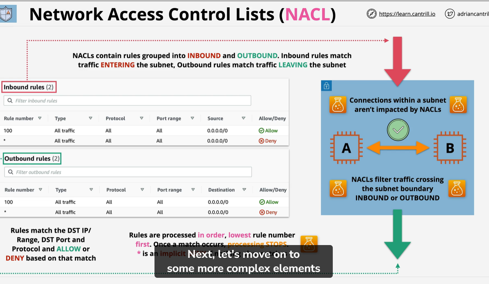

# NACL (Network control list)
    NACL is a traditional firewall within AWS VPC.
    Example:
        Subnet with in VPC have two Ec2 instance A and B. The first thing need to understand they are associated with subnet. 
        Every subnet associated with NACL. 
        NOTE:
            NACL filter data crossing the subnet boundry inbound and outbound.
        In practice if any data is comming into the subnet is effected and data leaving the subnet is effected. 

       Importent to remember connection within subnet, such as between instance A and instance B in this example not effected by network ACLs. Each Network ACls contain number of rule, two sets of rule to be precise we have inbound and outbond rule.
        Inbound:
        Inbound rule only effect the data entry the subnet. 
        Outbound:
        Outbound rule only effect the data leaving the subnet.

        From previous lesson this is not always matching directly to request and response. A request can be either inbound and outbound as can response.  The inbound and outbound are focused only on direction of traffic not on request and response. 
        NACL is stateless which mean they do not know is traffic requst or response. it is all about direction. 
        Rule match destination IP or IP range. destination port or port range togather with protocol. So they can explicity allow or deny traffic. 
        Remember NACl offer both explicit allow and explicit deny.
        Rule process in order. First Nerwork Acls determines if is inbound or outbound rule aply. then it start from lowest rule number.  It evaluate traffic against each individual rule until it find a match. Then traffic is either allowed or deny base on rule then processing stop.
NOTE        
    It is hard to understand. if you have a deny rule and allow rule match the same traffic. but it deny rule come first, then allow rule might never processed. 
    
    Lastly as catch all showed by asterisk (*) in the rule number this is implicity deny. If nothing else match then traffic will be deny.  

    NACL is a stateless which mean rule is require for both request and response part of every communication need individual rule Inbound and Outbound.     

Example:
    Multi tier example is running in a VPC. we have web server left and application server right. On left we have a user BOB using laptop he is accessing website. he make a connection using HTTPs  with port tcp 443. This is a request and this is also going by mean the response is required using the emphemeral port range. The emphemeral port chosse at randon from available range of Operating system of Bob laptop. Now to allow this communication , if we are using Nacl then we will need to have one associated with web subnet  and it will need rule inbound and outbound section. 

    Notice how in inbound rule set we have rule number 110. which allow connection from anywhere 0.0.0.0/0 to through this Network Acls. this is allowed as long as it using Tcp port 443.  So this is what allowed request from Bob into web servr.
    we also have outbound rule set for rule number 120 this allowed traffic anywhere with 0.0.0.0/0 as long as port tcp is using the port range between 1024-6555 this is a emphemiral port range. This is not amazingly secure but with stateless fire this is only way. Now we also have implicit deny this is denoted by rule of * in rule number which mean anything which is not match 110 and 210 it will deny.
    Now notice we have rule 110 and 120 number differently, the rule number are unique on inbound and outbound. So we could have single rule 110 on both rule set and that would be OK. It is just esier if we use 2 different rule for each different rule sets. 

    Example:
        we have same architecture we have Bob on right , web subnet in middle and App on left. Because Netwrok ACLs mean each communication require one request rule and one response rule. When you have multi tier architecture it will be more complex . let's say Bob initiate a request to connection web server. If we have a NACL around web subnet we will need inbound on web Network ACls. There also going to be response traffic. This is going to use emphemeral port range and this going to need outbound rule on same web NACL. May be websubent want to communicate with app server using TCP port. Now this is techinical crossing two subnet boundries. the web subnet boundry and application subnet boundry. So It going to need outbound rule on web subnet NACL and also inbound subnet rule on application subnet NACL. Then we have a response for that aswell from app servrer to web server this is going to be use emphemeral pot.
        But this is also crossing two subnet boundries. It leaves the application subnet which will need outbound rule on that NACL and enter the web subnet which will also need inbound rule on Netwerk ACLs. 
        And what if each of these server need software update?
        It will get more complex.  The application port request and emphemeral response for every single communication,  you are going to have multi tier architecture, this might mean communication go through different subnet. If you need software update this more. If you use Network address translation or NAT, You might need more rule still. you need to worry about this if you use a Network ACLs within VPC for traffic to VPC or traffic from VPC or traffic between subnet inside that VPC.

    # DEFAULT NACL
        A VPC created with default NACL. which contain inbound and outbound rule have implecit deny(* ) and Allow All rule.
        The result is all traffic is allowed.

# NACL ACcess control list (NACL)
    1 it is a state less- Request and response seem as different.
    2) Only impact data crossing the subnet boundry. Mean communication with in subnet is not effecting by NACL.  If you have data across the subnet the make sure both NACL have Inbound and Outbound rule add. 
    3)NACL explicy Allow and deny traffic . Mean in Deny we can block spacific IP and spcific IP range. 
    4) NACL have no logical resources. They only have IPs/CIDR , Port and protocol.
    5) NACL can not assign to AWS resource. only subnet.
    6) Use togather with Security group to add explicity Deny (BAD IPs/Net#)
    7) Each VPC have one NACL Default or Custom
    8) NACL can be associated with many subnet.
    