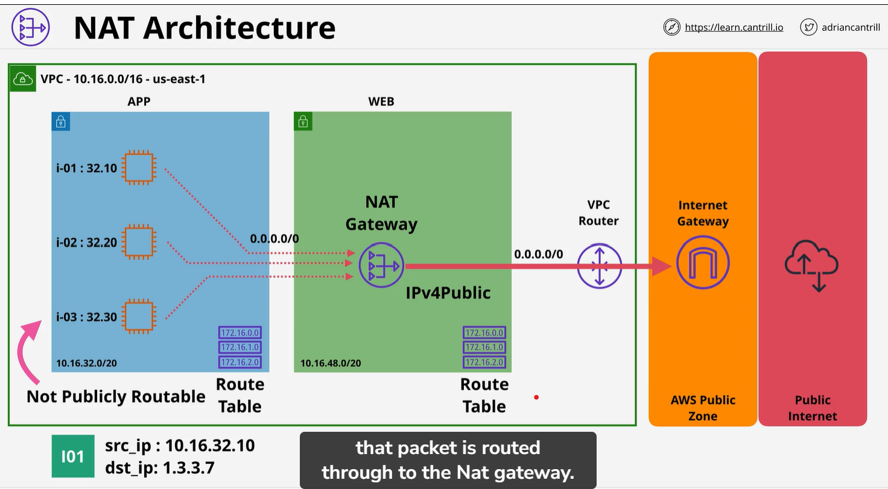
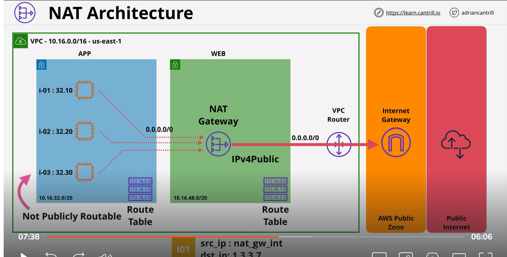
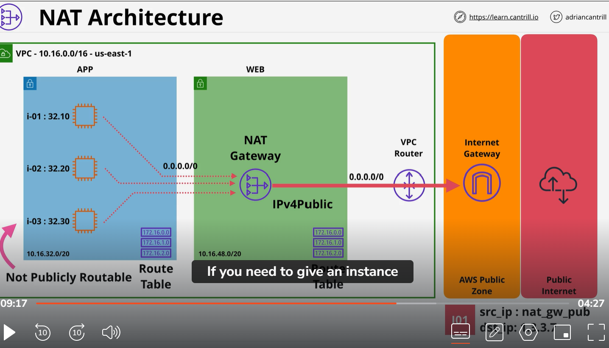

# NAT   
    1)Network address translation and NAT Gateway
    2) A set of processing - remapping source or Destination IPs
    3) IP masquerading - hiding CIDR block behind the one IP, And IP masquerading hide a whole private side IP block behind single public IP. Rather then one private IP to public IP. The internet gateway does , NAT many private IPs to one single IP. IP4 version IP is running our space. 
    4)  Give private CIDR range outgoing internet access and AWS public zone.
    5) Many private IP use single public IP incomming access does not work. Private devices use NAT can initiate outgoing  connection to internet or AWS service. You can not initiate connection from public subnet to private subent through NAT is used.
    6) AWs provide 2 way to use NAt
        1 )you could use Ec2 instance, configure to provide NAT. 
        2) They also manage service for NAT gateway which you can provision in VPC
    
Eample:
    on left application test of NAT blue, it use IP range 10.16.32.0/20. So this is private only subnet. in this subnet we have three instance i02,i02,i03. IP address of these instance is private. So not publicaly routeable. They can not communicate to public internet or AWS public services.  if we want to be allowed these instance to perform certain activity using public network. for example software update , For that we could make a software public in same way we done with public subent so web subnet. Which is not good according to our architecture. 
    So we can also host some software update server inside the VPC and some business to choose to do that. Some business run window or linux update within privte network. but that come admin over head.
    we provision NAT gateway into public subnet. And remember public subnet allows us to use public IP address the public subent. public subnet has a route table attached to it. which provide default IPV 4 route pointing at the internet gateway. which mean NAT gateway in public IP which is route across the public internet. So it now able to send data out and get data back in return. Now private sunbnet where instance is located can also have it own route table. tis route table can be different than public subent route. we could configure route table so that route table on the application subnet has a default IP version 4 route. but this time instead of pointing at the internet gateway  like web server subnet users, that is point to NAT gateway. This mean instance sending data to any IP address  that do not belong to inside the VPC. 
    By default this default route will be use and the traffic will get send to NAT gateways. let see how packet flow works. one of private instance ans see what NAT gateway actually does.  First instance one generate some data let assume looking for update . Packet have source IP address of private instance, and destination address 1.3.3.7.  Because we have a default route  on route table of application subnet That packet route to NAT gateway.NAT gateway make a record of data packet   
    It store the destination of packet  that packet is for . 
    
    the source address of instance sending it and other detail which help in indenty specific communication in future. Remember multiple instance can communication at once. And for each instance it could have multiple conversation with differnt public internet host.
    Then Nat gateway change the source IP to be own source address. Now if NAT appliance where anywhrer but AWS  

    NAt gateway job is allow to multiple private IP addresses to masquerade behind the IP addres it has. NAT gateway take all incomming packet from all private instance that its managing and it record all communication information. It take those packet and change the source address of those instance to own external facing IP address.  In AWS it does not have directly attach to real public IP. The internet gateway transalte from its IP address to associated public one. 

    
    If you want to access through public subnet then you just need IGW. But if you want many to one mean private instance access to internet then you need NAT gateway . Then internet gateway translate from IP of NAT gateway to real public IP version 4 address. 

# NAT gateway key fact.
    1) Run in public subnet
    2) Use elastic IP (static ipv4 address): static mean Ip do not change
    3) NAT gateway is AZ resiliance. They can recover inside in AZ but if AZ fail it will not recover. 
    4) For fully resiliance mean for region resilieance you have to deploy NAT gateway in each AZ that are you using in VPC
    then Route table in for each AZ with NAT gateway as target
    Mean  for every AZ you use you need one NAT gateway in each AZ and one route point to  NAT gateway.

    5) NAT gateway is managed service scale up to 45 GBs $Duration + Date time 
    6) It it hourly charge service and also have data processing charge same  