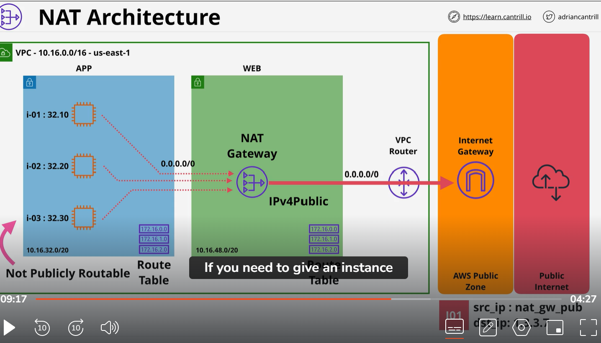

# NAT gateway part 2:
    you need NAT gatewau inside each AZ that VPC we use. Then you need private route table in each AZ. in our example AZ A , AZ B and AZ C. Each AZ have own route table which would have IP version 4 route, which point to NAT gateway in same AZ. That way if any AZ fail , other will continue to operate without any issue. 
    Sometime ask in exam question one NAT gateway is enough that NAT gateway is region resilieance? this is false. NAt gateway is higly available in AZ . If whole AZ fail NAT will fail. Internet gateway is region resiliance. 
    

    NOTE:
         if you want to use Ec2 instane as a NAT instnce then you have to check source/Destination check. 

    When to use NAT gateway?
        if you value high available, band width, low level maintenane and high performance.  
    When to use NATinstance ? 
        NAT instance have limitation by capabilities its running on , A Nat intance is single instance is running inside in AZ. It will fail if EC2 fail, it will fail if storage fail , or networking or AZ fail if fail

        NAT gateway have some benifits on Nat instance. So inside one  AZ it is higly available, it can automatically recover. 
        Nat gateway scale automatically. NAT gateway is not free teir . 
        NAT instance you can connect to them just like any other Ec2 instance. 

    
