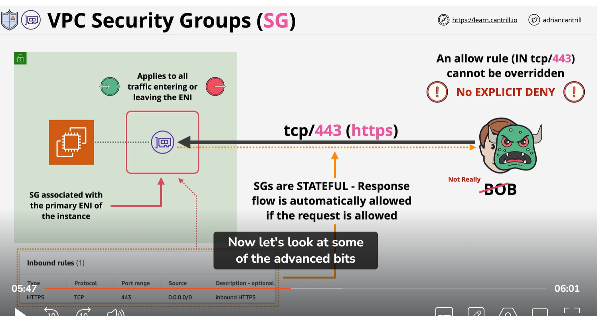
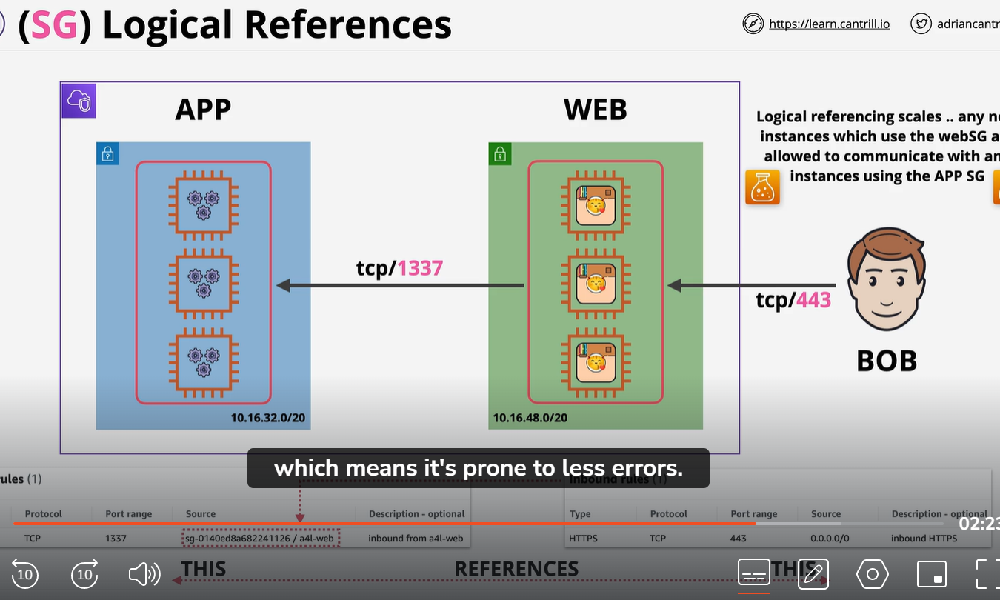
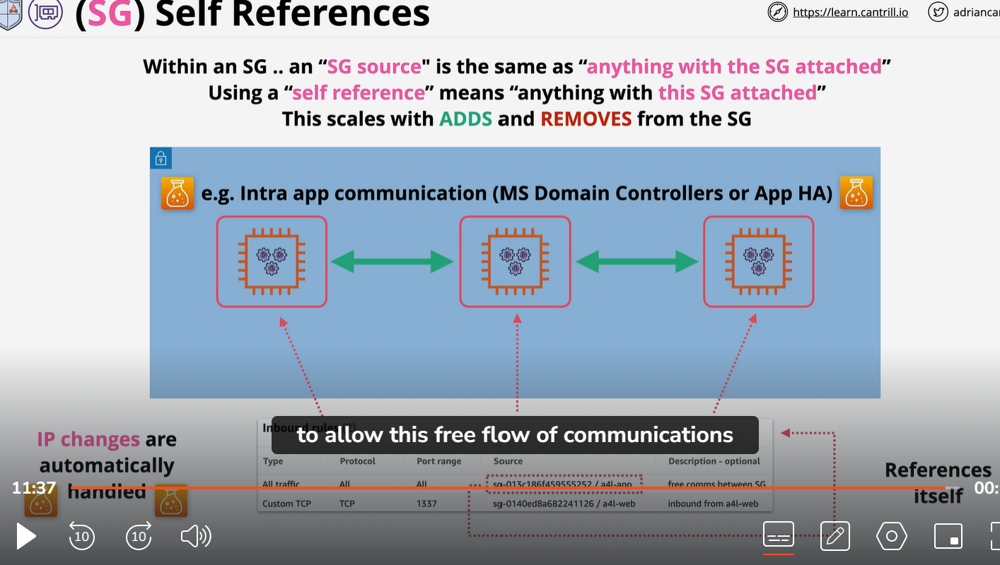

#  VPC security group
   1)  Stateful : mean detect response traffic automatically
   2) Allowed IN or Out request = allowed response
   3)  No explicity DEny  : only allow or implicity Deny
   4) can not block specific  bad actor (mean we can not stop IP range or IP in sg)
   5) supporting IP/CIDR  and logical resources
   6)  include other security group anf itself
    7) Security group not attach to ENI (elastic network interface) not instance. 

Example:
        we have a public subent containing Ec2 instance which attach to primary ENI (elastic network interface). on right side we have Bob. Which access this instance using TCP port 443. conceptuly SG as something which sround by Secruity group. In this case primary interface of Ec2 instance. This is how typical Security group look like. It has inbound and outbound rule just like NACL. Security group apply to all traffic which enter or leaves the network interface. Because thye are stateful because we allowed tcp port 443 as request portion of communication, the connection from the instance back to Bob.
        It automatically allowed . security group can not explicity block traffic. This mean with this example if you are following 0.0.0.0/0 to access the internet on tcp port 443 and this mean whole IP version 4 internet. you can not block. imagine Bob is not good actor so we can not block him.

    

    SG logical reference:
        we start with VPC contain public subnet and private application subent inside web subnet we have categram application instance. Inside app subnet we have backend application instance. Both of these protected by Security groups. we have A4lweb and a4lapp. Traffic wise Bob accessing the web instance over port 443.  And because this is entry point for application which logically have   all user than BOb. we are allowing TCP port 443 from any IP version 4 address.
        This mean we have security groip with inbound rule set which look like this, web instance also need to connect with application instnace for this example let see this is unique tcp pot 1337. our application is that good.
         So best to allow this communication ?
            well we could add IP address of web instance into security group of application instance. or If you wanted to allow our application to scale and change IPs we could add CIDR range of subnet instead of Ip.
            So that is possible but not taking advantages extra functionality which security group provide. we could do reference the web secruity group with in application security group. So in this Application security group notice that allow tcp port 1337 inbound. but it reference as a sources a logical resource, the security group. 
            Now using logical resouces in this way mean source reference , so a4l-web secrurity group . This actually reference anything with has this security group associated with It. S in this example any instance which have A4l-web security group attached to them can connect to any instances which have a4l-app security group using TCP port 1337. 

            So this logical reference with in a4l-app security group reference the web secruity group and anything which has the web security group attach to it. So we do not worry about IP range or CIDR range. It also have another benifit.  I scale realy well So additional instance added to application subnet and web subnet and as they those instance attaached to relevent security group they are impacted by this logical reference. allowing anything define withi sg to apply any new instance. 
            so this reduce the admin overhead. when you have multi tier application. It also simplify security management .which mean prone ro less error.
            logical reference provide more functionality. 

    # SG self reference
        private subnet inside AWS with ever changing number of application instance. right now it is 3 but it might be 30 or 1. we can create a security group like below pic. this one allow communicatino tcp port 1337. from web security . But it is also have rule All traffic which is self reference rule allowing all trafic. what this mean is that attched to all these instance then anything security group attach can recieve communication. so all traffic from security group. It allow to enable two instance to communicate which have it attached from secruity group. It handle any Ip changing automatically. which is usefull these instance are on auto scaling group which has provisioning and termination instance base on load on system

