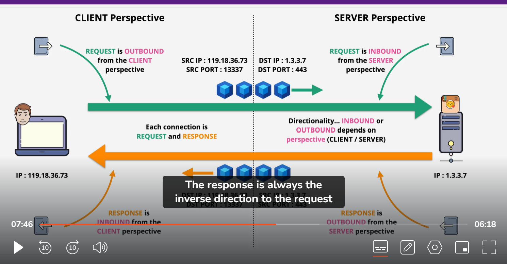
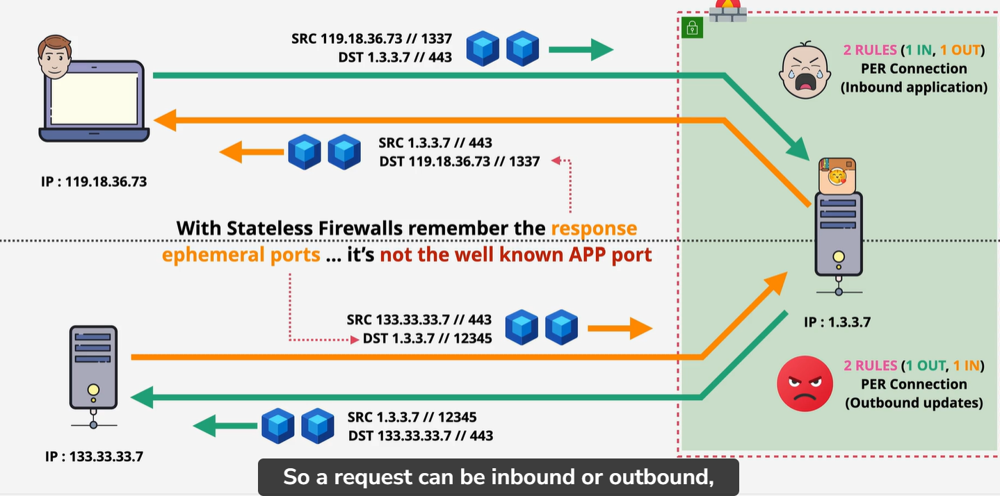

# stateful and Stateless
    # TCP (Transfer control protocol):
        TCP is a connection base protocol. A connection is establish between two devices using a random port on client side and known port on server side.
        Once establish a connection it is a bi directional . 

        Explanation:
            When you make a connection using TCP, It sending IP packet to each other. 
            These IP packet have source and destination IP carried from local network to public server (internet). TCP is a layer 4 protocol which run top of IP. It add error correction togather with idea of ports. So HTTP run on tcp port 80 and HTTPS run on ports 443. 

    statefull vs stateless Firewall:
        imagine we have a Bob who want to connect to server.
        Here connectionh have 2 part:
        1: First we got request part , Where client request some information from server. In our case images.
        2: Then we have a response part. Where data is return to client.  Basically they are a connection between server and client. But in depth these are different component.

        What actually happen:
            1: client pick a temporary port which is known as emphomoral port. So typically port has a value from 1024 to 65535. But this range depend on OS. 
            2: After select the empeneral port . The client initiate the connection to server using well known port number. Now well known port number is a port number  which is typically associated with  one specific populer application or protocol. In our case TCP protocol HTTPS/443:

            3: Next server response back with actual data. Server connect back with  source IP of request part, in our case is BOB laptop. It connect to source port of request part which is empemoral port. This part is known as response. 
      

You can see more detail in pic which id down below.
    On left side we have a user and right side server. Each connection is a request and response. 
    Directionality Inbound or Outbound depend on perspectice (Client /server)
    In our case client generate a request and I have added  the IP address on here for both client and server.
    This mean packet send from client to server which is flowing from left to right. This IP have source IP address 119.18.36.73 and Source port 13337 and desitnation IP 1.3.3.7 and Detination port 443 . Here source port is emphemeral port and destination port is well known port.
    Guess This request is outbound or inbound?
    It is both: from client perspective is Outbound, If you are looking from clinent side you are looking allow or deny an outbound connection. 
    From server point of view it is inbound connection. But we have a response part from server to client in yellow line. which is collection of packet moving from left to right. Here is source IP is 1.3.3.7 and sorce port is 443 and destination IP 119.118.36.73 and destination port is 1337.  Here directionality  from server it is outbound and from client side it is inbound. 

    NOTE:
        Two things to remeber when dealing with firewall:
            1: First each connection between client and server has two component. request and reponse . Request is from client to server and Response is from server to client. The Reponse is always inverse of request.
            The Direction of request is not always outbound and is not always inbound. It depend on what that data is. 

Example#2:
    we have Bob and catagram server and we also have software update server.  Categram server inside subnet protected by firewall. Spacifically this is a stateless firewall. 
    Stateless firewall mean it does not understand state of connection.  It mean it can see request connection from Bob laptop to categram, and reponse from categram server to Bob laptop is two individual part. You need to think about allowing and denying as two part.. You need two rule, One is inbound rule , which is request and one outbound rule for response. 

    When Bob is making a request that request is inbound to categram server. This reponse logically enough is outbound. sending data back to BOb laptop. 
    Consider new situation  where categram server is performaing software update well in this sistuation request from categram server to software update is outbound. The response from software server to categram server is inbound. So when are you thinking about  this, start with request,
     Is requst comming to you, or going to somewhere else? So response always be in reverse direction. So this situation require two firewall rules; one outbound for request and one inbound for response .  Now two realy important point for stateless fire rule.

     Any server where accept connection and where they initiatte connection. This is common in web server which need to accept connection from clients. but where also need to do software update. in this sitaution , you will have to deal with two rule.  So get used to think outbound rule can be both request and response.  Inbound rule can be request and response.
      it is confusing but just remember start by determine direction of request, then always keep in mind with stateless firewall, you are going to need inverse rule of response. 
      Now second importent thing, request is going to be well known port mean desintation port. 
      If you are managing firewall for categram server . You will need to  allow connection to TCP 443, The response always from server to clent. But this always use emphemeral port. Because firewal is stateless. Because he has no idea which specific port is use for response. So you will have to allow the full range of emphemeral port to any destinataion. 

        NOTE keep in mind every request have a response. And for response we meed to open emphemeral port. 

  
    # STATEFUl:
        A statefull firewal is intelegent is enough to identify request and response component of connection as being related.
        
        Bob laptop on left and categram server and have upate software server. Since port and IPS same it can link one to the other. As this mean specific request to categram server from bob laptop the firewall automatically known which data is the response. And same is true for software update server. For given connection to software upate server. The firewall smart enough to see the response. so return data is yellow line from software update server  back to categram server . As this mean that stateful firewall, you will only have to allow the request or not and the response will be allowed     or not automatically.  This significantly reduce the admin overhead and chance for mistake. In addition you do not need to allow full emphemeral port. because firewall can identify which port is being used. and implicitly allow base on it being reponse.
        
