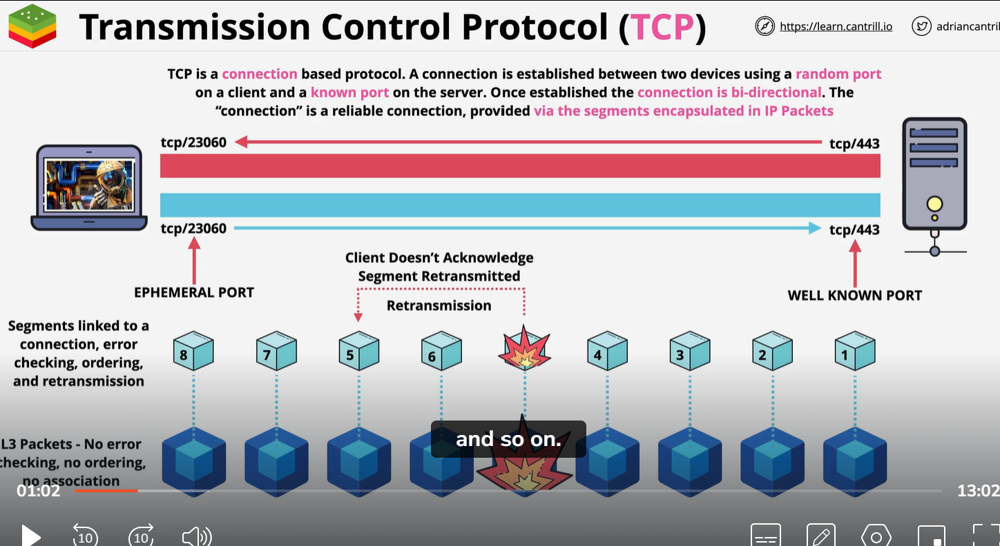
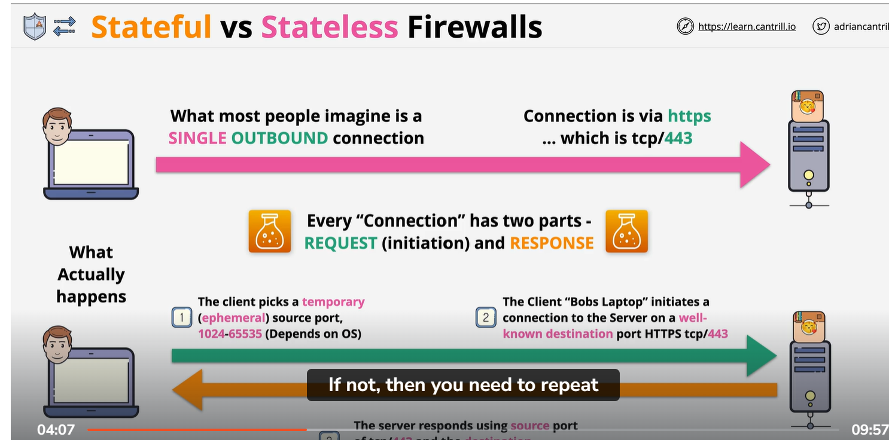

# stateful and Stateless
    # TCP (Transfer control protocol):
        TCP is a connection base protocol. A connection is establish between two devices using a random port on client side and known port on server side.
        Once establish a connection it is a bi directional . 

        Explanation:
            When you make a connection using TCP, It sending IP packet to each other. 
            These IP packet have source and destination IP carried from local network to public server (internet). TCP is a layer 4 protocol which run top of IP. It add error correction togather with idea of ports. So HTTP run on tcp port 80 and HTTPS run on ports 443. 

    statefull vs stateless Firewall:
        imagine we have a Bob who want to connect to server.
        Here connectionh have 2 part:
        1: First we got request part , Where client request some information from server. In our case images.
        2: Then we have a response part. Where data is return to client.  Basically they are a connection between server and client. But in depth these are different component.

        What actually happen:
            1: client pick a temporary port which is known as emphomoral port. So typically port has a value from 1024 to 65535. But this range depend on OS. 
            2: After select the empeneral port . The client initiate the connection to server using well known port number. Now well known port number is a port number  which is typically associated with  one specific populer application or protocol. In our case TCP protocol HTTPS/443:

            3: Next server response back with actual data. Server connect back with  source IP of request part, in our case is BOB laptop. It connect to source port of request part which is empemoral port. This part is known as response. 
      
