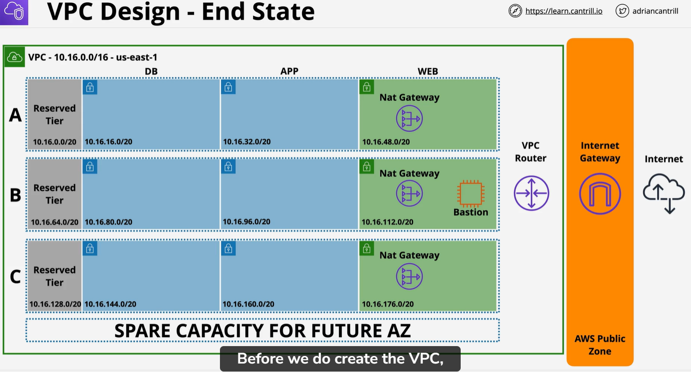
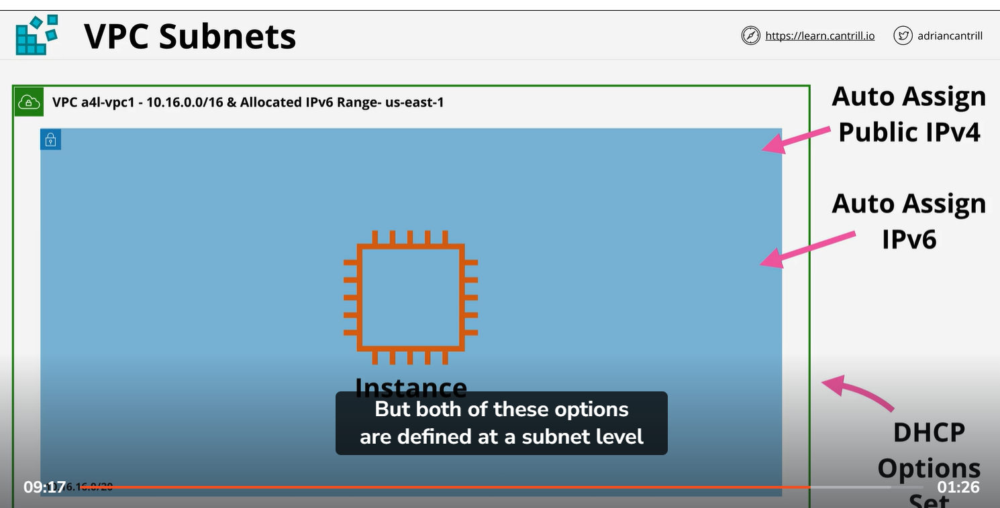

# VPC Diagram

# Custom VPC:
    1) VPC is a regional service
    2) isolated network
    3) Nothing in or out without explicit configration
    4) flexible configration : simple or multi tier
    5) Hybrid networking - other cloud or on-premise
    6) Default or dedicate service
    7) IPV4 private CIDR Block and public IP
    8) 1 primary private IPV4 CIDR block
    9) Min /28(16) and max /16(65365) IP
    10) optional secondary IP block (default is 5 but it can be increase after using support ticket)
# DNS in VPC:
    1 provided by Route53
    2 VPC  'Base Ip + 2' address
    3 enableDNS hostname - give instance DNS name. if set true then intance have DNS it not set true then instance have not true 
    4 EnableDNS Support - enable DNS resolution in VPC

https://docs.aws.amazon.com/vpc/latest/userguide/amazon-vpc-limits.html

# VPC subnet
    1) AZ resilient (it is create within AZ and never be change .if AZ fail subnet will be fail)
    2) A subnetwork of VPC === with in perticuler VPC
    3) thing to Remember for exam:
        1 subnet within one AZ
        2 Subnet can never be more than one AZ
        3 one Az can have 0 or more than 1 subnet
    4) Subnet have IPV4 CIDR of VPC CIDR
    5) cannot overlap with other subnet
    6) subnet can have optionaly IPV6 CIDR (/64 subnet of /56 VPC,)
    7) subnet within VPC can communicate with other subnet 

Subnet IP Address
1 Reserved IP address
2 10.16.16.0/20 (10.16.16.0 => 10.16.31.255)
3 Network address 10.16.16.0
4 Network +1 : 10.16.6.1
5 Network +2 : 10.16.6.2
6 Network +3 : 10.16.6.3
7 Broadcast Address: 10.16.31.255 (last IP of subnet)

DHCP option set:
  DHCP stand for dynamic host configration protocol
  Due to this computing device recieve IP automatically 
  

Subnet calculator
https://www.site24x7.com/tools/ipv4-subnetcalculator.html  