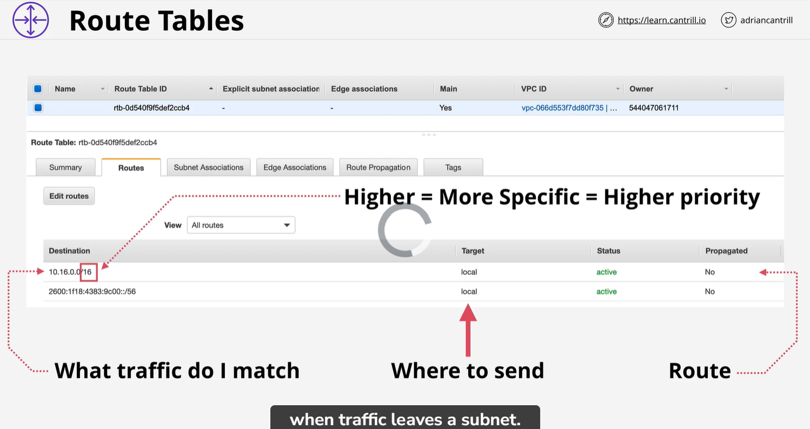
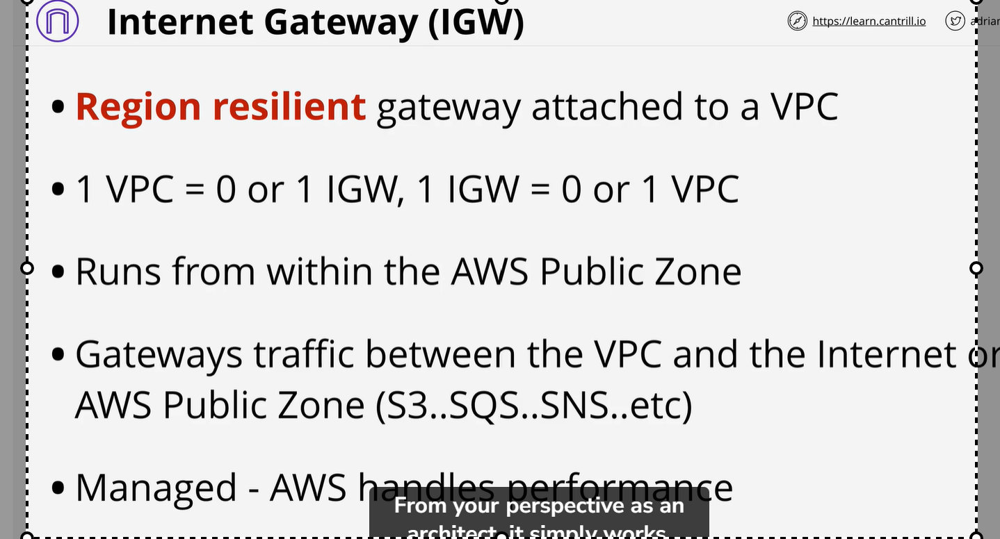
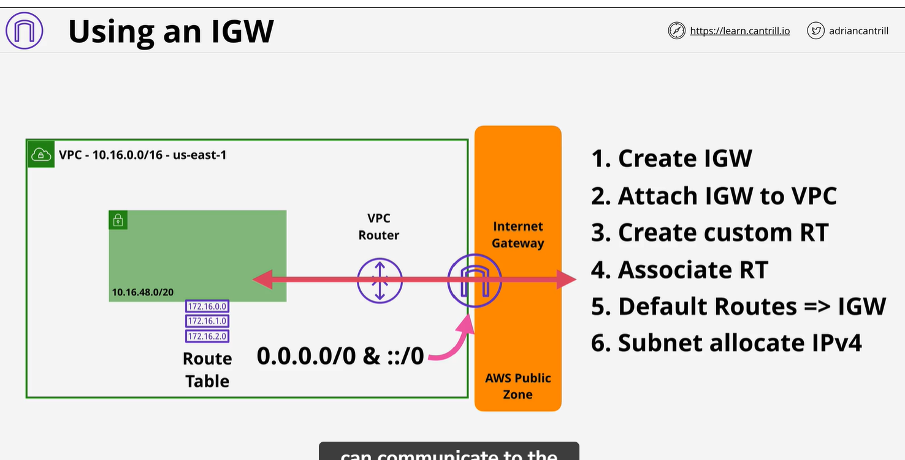

# VPC Routing :
    1) Every VPC has a VPC router - which is high available 
    2) The router have a network interface in every subnet in your VPC. 
        in every subnet (network + 1) address
    3) VPC route traffic between subnet within VPC(like one ec2 instance want to talk other Ec2 instance with different subnet : VPC route help for that)
    4 VPC routing controll by route table , Each subnet has one
    5 VPC has a main route table - subnet default. If you do not explicit custom route table with subnet. It use the main route table of VPC. If you do associate custom route table the main route table diassociate.  
    NOTE:    A subnet can only have one associate route table at any time. But route table can have many subnet

The destination field determin what destination route match.  Now destination filed on a route match exect one match IP address it could be a one IP with /32 CIDR. But destination field could also be a network. So route match one network. IT could be a default match like 0.0.0.0/0 which match everything.

    Local route always take perioritys
    Higher prefix value take more periority

# Internet gateway:
    1 ) region resilient : gateway attached to VPC
    2) One internet Gateway cover all AZ with in region.
    3 gateway traffic between VPC  and internet or AWS public zone(S3, SQS, SNS)
    4) It is AWS managed 

