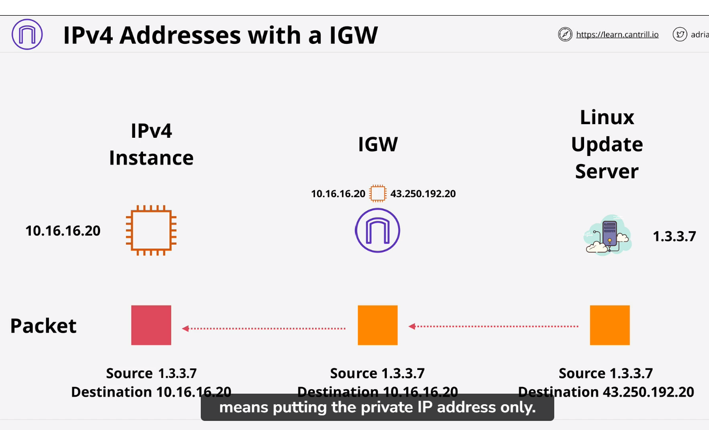

# VPC Routing :
    1) Every VPC has a VPC router - which is high available 
    2) The router have a network interface in every subnet in your VPC. 
        in every subnet (network + 1) address
    3) VPC route traffic between subnet within VPC(like one ec2 instance want to talk other Ec2 instance with different subnet : VPC route help for that)
    4 VPC routing controll by route table , Each subnet has one
    5 VPC has a main route table - subnet default. If you do not explicit custom route table with subnet. It use the main route table of VPC. If you do associate custom route table the main route table diassociate.  
    NOTE:    A subnet can only have one associate route table at any time. But route table can have many subnet

The destination field determin what destination route match.  Now destination filed on a route match exect one match IP address it could be a one IP with /32 CIDR. But destination field could also be a network. So route match one network. IT could be a default match like 0.0.0.0/0 which match everything.

    Local route always take perioritys
    Higher prefix value take more periority

# Internet gateway:
    1 ) region resilient : gateway attached to VPC
    2) One internet Gateway cover all AZ with in region.
    3 gateway traffic between VPC  and internet or AWS public zone(S3, SQS, SNS)
    4) It is AWS managed 

    Using internet gateway:
        1) Create IGW
        2) attach IGW to VPC
        3) Create custom RT
        4) Associate RT
        5) DEfault RT
        6) subnet allocate IPV4 

Ip4 Address with IGW
    Explanayion:

        If Ec2 instance have IPV4 to communicate with software update server of some kind. we have IGW in between. imaging Ec2 instance want to update to linux server which is located in public internet zone. Let say instance have 
        10.16.16.20 and it also have public IP address IPv4 43.250.192.20. 

        With private IP instance will not go to internet. but when you attach public IPV4 to instance then record is created which internet gateway maintained.  So Internet gateway have instance private IP to allocate its public IP.  instance itself not configure with public IP.  That is way when you create Ec2 instance and allocate it public IPV4 address, inside the operating system. It only see the private IP. 
        NOTE :
            IPV4 (version 4) not configured in OS with public IP address.

        When linux instance (EC2 ) want to communicate with linux software update server, it create a packets of data. Packet have a source address and destination address( of linux software update server). Source address is private IP of Ec2 which is 10.16.16.20 and destination address eg 1.3.3.7. So at this point packet is not configure at any public IP address. This packet will not be routeable across the public internet. It could not reach linux public server. 
        Packet leave the instance and because we have configure default route so it arrive to IGW . The internet gateway see the packet which is from the Ec2 instance.  IGW know Ec2 have public IPv4 public IP associated. So It chagne the packet source IP address to public IP address that allocate to instance.
        Now source address change from private IP to public IP 43.250.192.0 . So IGW forward the updated packet on to its destination. 

        On the way back lniux server send packet back to Ec2 instance. It only know the public Ec2 addreess.  Now source change 1.3.7 and destianation to 43.250.192.0 . so packet travel over the internet and arrive to IGW.  So IGW change the destination addres to privte address. and forward this packet to orignal this Ec2 instance. 

        NOTE: Do not fall exam question which try to convince you to assign public IPV4 address directly to Ec2 instance.
        For IPV6 all address the AWS uses are nativly, publicaly  routeable. In case of IP version 6 Operating system does have IP version6. so all traffic . Here all IGW does is pass traffic from instance to internet server and back again. It does not do any translation. 

# Bastion Host:
  1)  Bastion host = Jumpbox
  2)  it is a instnace in public subnet
  3) Incomming management connection arrive there
  4)  Then you can access internal VPC resource
  5) bastion host is a entry point from public subnet to private subent

Make subnet public:
1) attach IGW to VPC  , IGW is higly available which we use for public route 