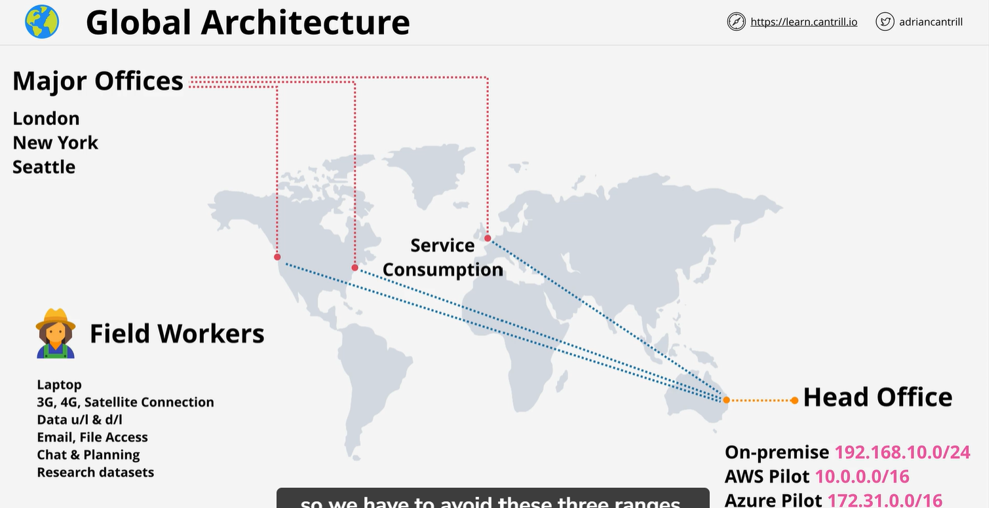

# VPC considiration:
    1 What vpc size should be mean range (how many )
    2 Are they any network we are not using
    3 remember other  cloud, VPC , On-premise, partner and vendor using
    4 Try to predict future 

NOTE:
    On-Premise: 192.168.10.0/24
    AWS pilot: 10.0.0.0/16
    Azure pilot: 172.31.0.0/16
All above IP we can not use and cannot overlap

More IP Range Avoid

NOTE : Try to avoid default VPC

# More considration:
    1 Minimum VPC /28 and maximum is 16
    2 personal prefrance for 10.x.y.z range
    3 Avoid common range for future issue
    4 reserve 2 + network per region be used per account

VPC sizing

we can not use VPC to deploy our app, we have to use subnet within VPC.
Subnet is located in one Az( availability zone). 
NOte :
 Before start you have to thing how many AZ in your VPC. This decision impract high availability and resilience. Some VPC have 3 and some VPC have more.

By-default statr with 3 Az and keep 1 spare. 
By degault tier. we have 4 (web, APP, DB , spare) 

If we use only one VPC then 1 tier meed one subnet mean 4 total. But now we have 4 AZ so and 4 tier so we need 16 subnets.

